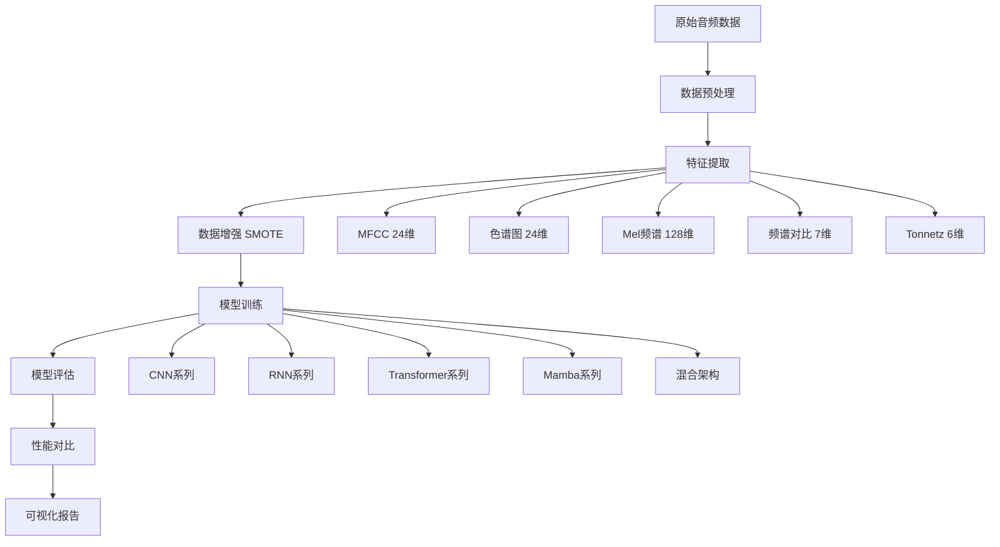

# 📋 ICBHI 2017 肺音分类项目

<div align="center">


**基于深度学习的多模型肺音疾病分类系统**

[English](#english) | [中文](#chinese)

</div>

---

## 📋 目录

- [项目简介](#-项目简介)
- [数据集](#-数据集)
- [系统架构](#-系统架构)
- [模型概览](#-模型概览)
- [安装指南](#-安装指南)
- [使用方法](#-使用方法)
- [实验结果](#-实验结果)
- [项目结构](#-项目结构)
- [技术栈](#-技术栈)
- [贡献指南](#-贡献指南)


---

## 🎯 项目简介

本项目是一个基于 **ICBHI 2017 呼吸音数据集** 的肺音疾病分类系统，实现了 **40种不同深度学习模型** 的训练、评估和对比分析。通过音频信号处理和机器学习技术，实现对6种不同肺部疾病的自动分类诊断。

### ✨ 核心特性

- 🔬 **多模型对比**: 实现40种不同架构的深度学习模型
- 🎵 **专业音频处理**: 使用Librosa进行高质量特征提取
- 📊 **全面评估体系**: 包含混淆矩阵、ROC曲线、PR曲线等多维度评估
- 🚀 **前沿架构**: 包含CNN、RNN、Transformer、Mamba等最新模型
- 📈 **可视化分析**: 完整的性能对比和可视化报告
- ⚡ **高效训练**: 支持GPU加速，优化训练流程

---

## 📊 数据集

### ICBHI 2017 呼吸音数据集

- **数据来源**: 国际生物医学健康信息学会议（ICBHI）2017
- **样本数量**: 920个音频文件
- **采样频率**: 4000-44100 Hz
- **录音设备**: 7种不同类型的听诊器和麦克风
- **患者信息**: 126名受试者的人口统计学信息

### 🏷️ 分类标签（6类）

| 类别 | 英文名称 | 中文名称 | 描述 |
|------|----------|----------|------|
| 0 | Healthy | 健康 | 正常呼吸音 |
| 1 | COPD | 慢性阻塞性肺病 | 慢性气道阻塞疾病 |
| 2 | Pneumonia | 肺炎 | 肺部感染性疾病 |
| 3 | URTI | 上呼吸道感染 | 上呼吸道炎症 |
| 4 | Bronchiectasis | 支气管扩张 | 支气管异常扩张 |
| 5 | Bronchiolitis | 细支气管炎 | 细支气管炎症 |

---

## 🏗️ 系统架构



### 🎵 特征工程

- **总特征维度**: 189维
- **MFCC**: 24维 - 梅尔频率倒谱系数
- **色谱图**: 24维 - 音调特征表示
- **Mel频谱**: 128维 - 感知加权频谱特征
- **频谱对比**: 7维 - 频谱峰值和谷值差异
- **Tonnetz**: 6维 - 调性网络特征

---

## 🧠 模型概览

本项目实现了40种不同的深度学习模型架构，涵盖了从基础到前沿的各种方法：

### 🔵 传统深度学习模型

#### CNN系列
- **基础CNN** (`basic_cnn`): 基本卷积神经网络
- **深层CNN** (`deep_cnn`): 多层卷积结构
- **批标准化CNN** (`batch_norm_cnn`): 加入BN层的CNN
- **残差CNN** (`residual_cnn`): ResNet风格的残差连接
- **多尺度CNN** (`multiscale`): 多种卷积核尺寸并行
- **可分离CNN** (`separable_cnn`): 使用深度可分离卷积
- **扩张CNN** (`dilated_cnn`): 使用扩张卷积增大感受野
- **密集CNN** (`dense_cnn`): 密集连接的卷积网络
- **金字塔CNN** (`pyramid_cnn`): 金字塔结构的CNN

#### RNN系列
- **LSTM** (`lstm`): 长短期记忆网络
- **双向LSTM** (`bilstm`): 双向长短期记忆网络
- **GRU** (`gru`): 门控循环单元
- **堆叠LSTM** (`stacked_lstm`): 多层LSTM结构

#### 混合架构
- **CNN+LSTM** (`cnn_lstm`): 卷积与循环的结合
- **CNN+GRU** (`cnn_gru`): 卷积与GRU的结合
- **注意力LSTM** (`attention_lstm`): 带注意力机制的LSTM

### 🟢 现代架构模型

#### Transformer系列
- **基础Transformer** (`transformer_like`): 多头自注意力机制
- **BERT风格** (`bert_like`): 双向编码器表示
- **GPT风格** (`gpt_like`): 生成式预训练架构
- **Vision Transformer** (`vit_like`): ViT在1D信号上的应用
- **层次化Transformer** (`hierarchical_transformer`): 多层次特征提取

#### 注意力机制
- **自注意力** (`self_attention`): 纯自注意力架构
- **交叉注意力** (`cross_attention`): 多分支交叉注意力
- **线性注意力** (`linear_attention`): 降低复杂度的线性注意力
- **稀疏注意力** (`sparse_attention`): 局部稀疏注意力模式

### 🟡 前沿创新模型

#### Mamba系列（状态空间模型）
- **纯Mamba** (`pure_mamba`): 基于选择性状态空间的模型
- **Mamba-Transformer** (`mamba_transformer`): Mamba与Transformer的融合
- **Mamba启发** (`mamba_inspired`): 简化版选择性门控机制
- **混合Mamba** (`hybrid_mamba`): 多分支Mamba架构

#### 特殊优化模型
- **宽深CNN** (`wide_deep_cnn`): 宽部分和深部分并行
- **局部连接** (`locally_connected`): 局部连接网络
- **全局最大池化** (`global_max_pool`): 使用全局最大池化
- **平均池化** (`avg_pool`): 使用平均池化策略
- **正则化模型**: L1/L2正则化优化 (`l1_regularized`, `l2_regularized`)
- **激活函数优化**: ELU、Swish等新激活函数 (`elu_cnn`, `swish_cnn`)
- **超大模型** (`mega_lstm`): 参数量极大的深层网络

---

## 🚀 安装指南

### 环境要求

- Python 3.8+
- CUDA 11.0+ (可选，用于GPU加速)
- 8GB+ RAM
- 2GB+ 可用磁盘空间

### 快速安装

```bash
# 1. 克隆项目
git clone https://gitclone.com/github.com/zb-tju/icbhi-lung-sound-classification.git
cd icbhi-lung-sound-classification

# 2. 创建虚拟环境（推荐）
python -m venv venv
source venv/bin/activate  # Linux/macOS
# 或
venv\Scripts\activate  # Windows

# 3. 安装依赖
pip install -r requirements.txt

# 4. 验证安装
python -c "import tensorflow as tf; print('TensorFlow版本:', tf.__version__)"
```

### GPU支持（可选）

```bash
# 安装CUDA支持的TensorFlow
pip install tensorflow-gpu==2.12.0
```

---

## 📖 使用方法

### 1️⃣ 数据准备

```bash
# 创建数据目录
mkdir -p Data/ICBHI_final_database

# 将ICBHI 2017数据集放入以下目录结构：
Data/
├── ICBHI_final_database/     # 音频文件 (.wav)
├── patient_diagnosis.csv     # 患者诊断信息
└── demographic_info.txt      # 人口统计信息
```

### 2️⃣ 数据预处理与特征提取

```bash
# 数据预处理
python Data_Preparation_and_Preprocessing.py

# 特征提取（这步较耗时，建议使用GPU）
python "Feature Extraction.py"
```

### 3️⃣ 模型训练

```bash
# 训练所有40个模型（耗时较长，建议分批训练）
python Model.py

# 或训练特定模型（修改Model.py中的model_names列表）
```

### 4️⃣ 评估与可视化

```bash
# 评估所有模型并生成报告
python "Visualization and Performance Metrics.py"
```

### 📊 自定义训练

```python
# 示例：只训练几个特定模型
model_names = ['basic_cnn', 'transformer_like', 'pure_mamba']

# 修改训练参数
epochs = 125  # 默认训练轮数
batch_size = 32  # 默认批大小
```

---

## 📈 实验结果

### 🏆 模型性能排行榜 (Top 10)

基于实际测试结果，以下是性能最佳的10个模型：

| 排名 | 模型名称 | 准确率 | F1分数 | AUC | Cohen's κ | 推理时间(ms/样本) |
|------|----------|--------|--------|-----|-----------|------------------|
| 🥇 | **Dense CNN** | **97.5%** | **0.9573** | **0.9994** | **0.9675** | **0.808** |
| 🥈 | **Residual CNN** | **96.0%** | **0.9601** | **0.9975** | **0.9478** | **1.205** |
| 🥉 | **Pyramid CNN** | **95.5%** | **0.9553** | **0.9979** | **0.9417** | **1.062** |
| 4 | Basic CNN | 94.0% | 0.9416 | 0.9975 | 0.9223 | 2.333 |
| 5 | Global Max Pool | 94.0% | 0.9401 | 0.9958 | 0.9218 | 0.545 |
| 6 | Locally Connected | 94.0% | 0.9405 | 0.9996 | 0.9221 | 0.394 |
| 7 | ViT-like | 93.5% | 0.9369 | 0.9978 | 0.9159 | 0.401 |
| 8 | Dilated CNN | 93.5% | 0.9358 | 0.9980 | 0.9155 | 1.051 |
| 9 | Deep CNN | 92.5% | 0.9256 | 0.9968 | 0.9027 | 2.211 |
| 10 | CNN-LSTM | 91.5% | 0.9142 | 0.9927 | 0.8887 | 3.430 |

### 📊 关键性能指标

- **最高准确率**: 97.5% (Dense CNN)
- **最快推理**: 0.394ms/样本 (Locally Connected)
- **最佳AUC**: 0.9996 (Locally Connected)
- **最佳F1分数**: 0.9573 (Dense CNN)
- **最佳综合表现**: Dense CNN (在准确率、F1分数和AUC上均表现优异)

### 🎯 模型特点分析

#### 🏆 顶级表现者
- **Dense CNN**: 在密集连接的帮助下实现了最高的准确率和F1分数
- **Residual CNN**: 残差连接有效提升了模型性能，仅次于Dense CNN
- **Pyramid CNN**: 金字塔结构在特征提取方面表现卓越

#### ⚡ 效率优秀者
- **Locally Connected**: 在保持高准确率的同时实现最快推理速度
- **Global Max Pool**: 简单有效的池化策略，推理速度很快
- **ViT-like**: Transformer架构在1D音频上的成功应用

#### 🔬 技术突破
- **现代架构的成功**: ViT-like模型展示了Transformer在音频分类上的潜力
- **传统架构的优势**: CNN系列模型仍然是音频分类的主力
- **效率与准确率的平衡**: 多个模型在高准确率和快速推理之间找到了良好平衡

---

## 📁 项目结构

```
icbhi-lung-sound-classification/
├── 📊 Data/                                    # 数据目录
│   ├── ICBHI_final_database/                  # 原始音频文件
│   ├── wavfiles_cleaned/                      # 清理后音频
│   ├── patient_diagnosis.csv                  # 患者诊断
│   ├── demographic_info.txt                   # 人口统计
│   └── data.pkl                              # 提取的特征数据
├── 🧠 Model/                                   # 训练好的模型
│   ├── basic_cnn.keras
│   ├── dense_cnn.keras
│   ├── residual_cnn.keras
│   ├── pyramid_cnn.keras
│   ├── vit_like.keras
│   └── ... (40个模型文件)
├── 📈 Evaluation_Results/                      # 评估结果 运行Visualization and Performance Metrics.py会自动生成
│   ├── ROC_Curves/                           # ROC曲线图
│   ├── Confusion_Matrices/                   # 混淆矩阵
│   ├── PR_Curves/                            # PR曲线
│   ├── Performance_Comparison/               # 性能对比图
│   ├── model_evaluation_results.csv         # 详细评估指标
│   └── evaluation_summary.txt               # 评估摘要
├── 🔧 Scripts/                                # 主要脚本
│   ├── Data_Preparation_and_Preprocessing.py # 数据预处理
│   ├── Feature Extraction.py                # 特征提取
│   ├── Model.py                              # 模型定义与训练
│   └── Visualization and Performance Metrics.py # 评估可视化
├── 📋 requirements.txt                        # 依赖包列表
└── 📖 README.md                              # 项目说明

```
---

## 🛠️ 技术栈

### 核心框架
- **TensorFlow 2.12+**: 深度学习框架
- **Keras**: 高级神经网络API
- **Librosa 0.10+**: 音频信号处理
- **Scikit-learn 1.3+**: 机器学习工具

### 数据处理
- **NumPy**: 数值计算
- **Pandas**: 数据操作
- **Imbalanced-learn**: 不平衡数据处理
- **SciPy**: 科学计算

### 可视化
- **Matplotlib**: 基础绘图
- **Seaborn**: 统计可视化

### 工具库
- **tqdm**: 进度条
- **pickle**: 数据序列化
- **glob**: 文件路径匹配

---

## 🔬 技术创新

### 1. 多架构全面对比
- 首次在肺音分类任务中系统性对比40种不同架构
- 涵盖从传统CNN到最新Mamba架构的完整技术谱系
- 为医疗音频AI提供了全面的基准测试

### 2. 特征工程优化
- 189维综合音频特征提取
- 音频包络检测去噪技术
- SMOTE数据增强解决类别不平衡问题

### 3. 实用性导向设计
- 重视推理速度，为临床应用提供参考
- 全面的评估指标体系
- 可重现的实验设置和详细文档

---

## 🚀 未来计划

- [ ] **实时分析系统**: 开发Web界面和移动端应用
- [ ] **模型集成**: 研究多模型ensemble方法
- [ ] **模型压缩**: 开发轻量级模型用于边缘设备
- [ ] **多语言支持**: 支持多语言界面和文档
- [ ] **临床验证**: 与医疗机构合作进行临床测试

---

## 🤝 贡献指南

我们欢迎各种形式的贡献！

### 如何贡献

1. **Fork** 本项目
2. 创建特性分支 (`git checkout -b feature/AmazingFeature`)
3. 提交更改 (`git commit -m 'Add some AmazingFeature'`)
4. 推送到分支 (`git push origin feature/AmazingFeature`)
5. 开启 **Pull Request**

### 贡献类型

- 🐛 **Bug修复**: 报告或修复问题
- ✨ **新功能**: 添加新模型或功能
- 📝 **文档**: 改进文档和注释
- 🎨 **优化**: 性能优化或代码重构
- 🧪 **测试**: 添加或改进测试用例


## 🙏 致谢

- **ICBHI 2017**: 感谢提供高质量的呼吸音数据集
- **开源社区**: 感谢所有贡献者和维护者

---

## 📞 联系方式

- 📧 Email: z1745743921@tju.edu.cn
- 💬 讨论: [GitHub Discussions](https://github.com/zb-tju/icbhi-lung-sound-classification/discussions)
- 🐛 报告问题: [GitHub Issues](https://github.com/zb-tju/icbhi-lung-sound-classification/issues)

---

## 📊 项目统计


---

<div align="center">

**⭐ 如果这个项目对您有帮助，请给我们一个星标！⭐**

**🔗 [项目主页](https://github.com/zb-tju/icbhi-lung-sound-classification) | [技术博客](https://683c463d95a674fef4f6b463--gregarious-cascaron-eee6dd.netlify.app/)**

</div>
